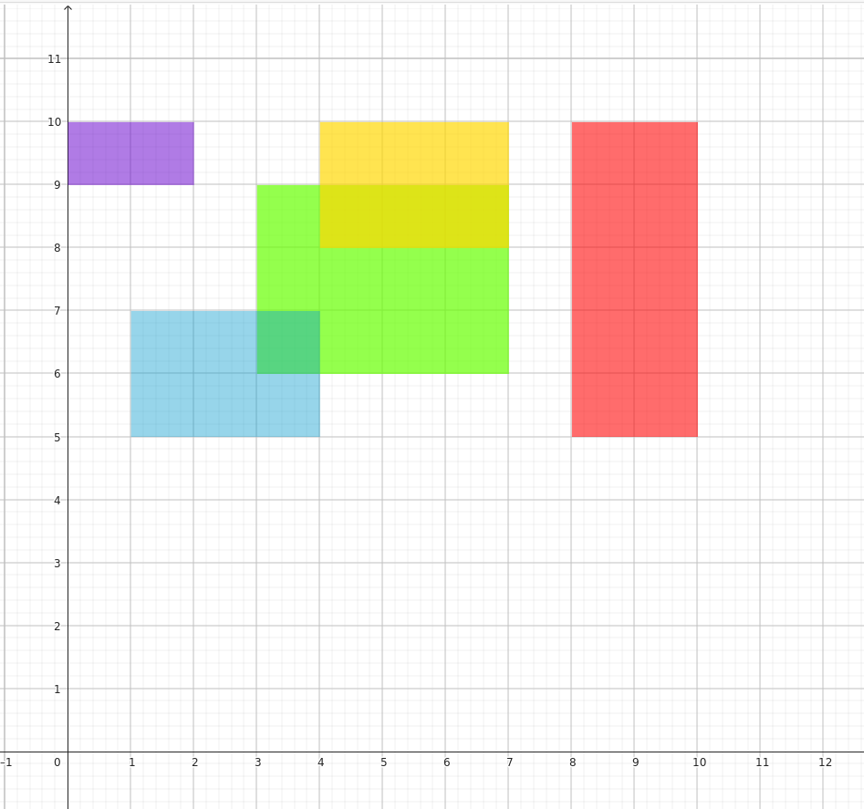
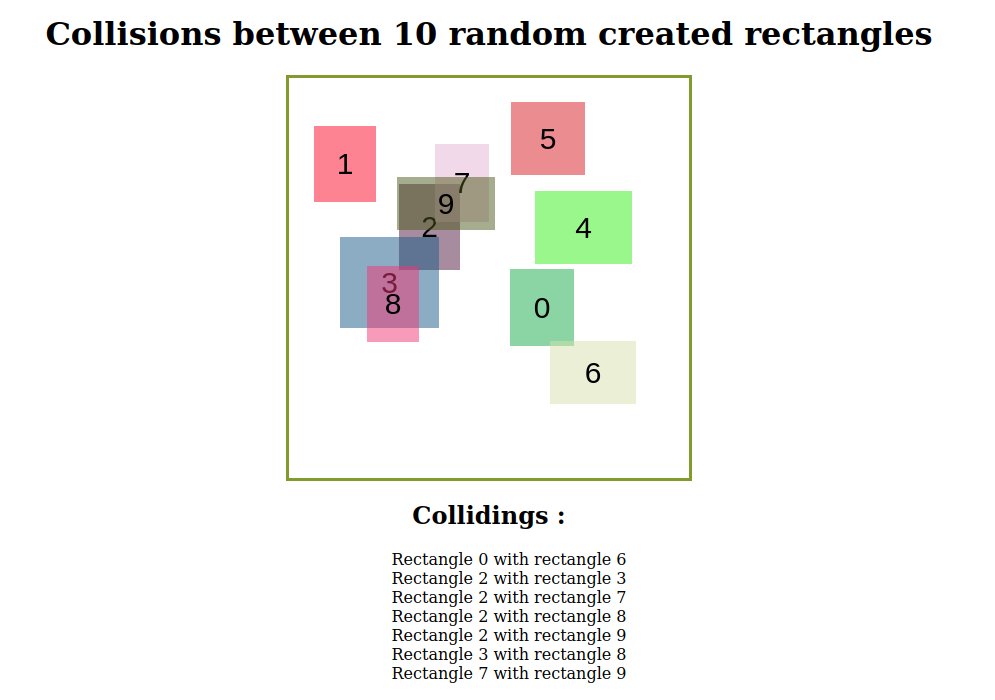

# algo-js
Becode exercise : learn the basics of algorithmics with JavaScript : 
1. Introduction
1. Control structures 
1. Arrays
1. Functions
1. Objects
1. Classes.

## Briefing
[Instructions](https://github.com/becodeorg/CRL-KELLER-6/tree/main/1.TRAIL/1.The-Field/5.Js) for the exercise.

## Extras
Figure of rectangles used to test exercise 6.2 :

Printscreen extra exercise 6.4 :

## Used languages
Javascript

## Authors
Virginie Dourson

## Date
09/2023

## Progression
WIP

## Github page
Github page for the extra exercise 6.4 : https://vdourson2.github.io/algo-js/

